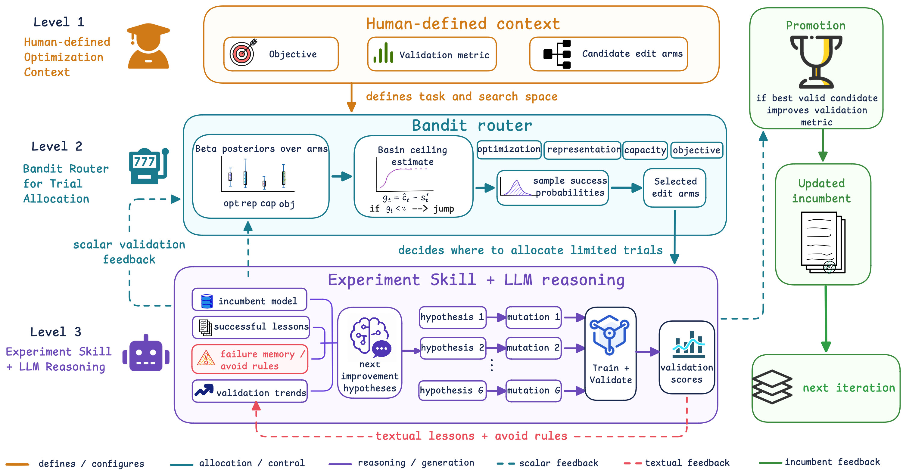

# RecHarness: A Bandit-Routed Agentic Harness for Self-Evolving Recommender Systems

Paper: [https://arxiv.org/abs/2607.29241](https://arxiv.org/abs/2607.29241)

Affiliations: Kuaishou Technology · Georgia Institute of Technology



RecHarness is a bandit-routed agentic harness that splits recommender-model optimization into "bandit picks the direction, LLM generates the hypothesis and code," achieving more stable, budget-efficient gains than pure LLM-reasoning search.

This Repo contains the source code, experiment entrypoints, model templates, benchmark harnesses, tests, and local-data preprocessing utilities used to assess the reproducibility of Our RecHarness.

## Artifact Contents

- `run2.sh`: Amazon Reviews sequential-recommendation experiment entrypoint.
- `gr.sh`: KuaiRec watch-time/ranking experiment entrypoint.
- `spooky.sh`: MLE-Bench Lite Spooky Author Identification experiment entrypoint.
- `prepare_gr_data.py`: local KuaiRec preprocessing utility.
- `prepare_spooky_data.py`: local Spooky Author Identification preprocessing utility.
- `gagc/data_preprocess.py`: local Amazon Reviews preprocessing utility.
- `gagc/agent.py`: Amazon and KuaiRec agent factories.
- `gagc/tools.py`: proposal, isolated execution, promotion, state update, and final evaluation tools.
- `gagc/state.py`: posterior, basin, queue, and Experiment Skill state.
- `gagc/grpo.py`: Thompson routing, composite arms, mutex filtering, and group advantages.
- `gagc/benchmarks/`: frozen benchmark contracts and metric computation.
- `gagc/templates/`: cold-start recommendation-model templates.
- `tests/`: unit tests for routing, benchmarks, arms, and the optional code-edit backend.

Only `run2.sh`, `gr.sh`, and `spooky.sh` are retained as experiment shell scripts.

## Environment

- Python 3.11 or newer is recommended.
- Linux is recommended for GPU execution and CPU-affinity support.
- CUDA-capable GPUs are required for the paper-scale runs.
- The default main-run budget is **43,200 seconds of total GPU/compute-time**. Parallel trials are charged by the sum of their measured runtimes, not by parallel wall-clock duration.

Create an isolated environment and install the artifact:

```bash
uv sync --all-extras
```

Configure the LLM provider through environment variables. Secrets are never stored in the source tree:

```bash
cp .env.example .env
export OPENAI_API_KEY=<your-key>
export OPENAI_BASE_URL=<your-gateway-url>   # only needed for a non-default gateway
```

The default provider (`llm_provider="openai"`, `model_id="glm_52_fp8"`) talks to any
OpenAI-compatible gateway via `OPENAI_API_KEY`/`OPENAI_BASE_URL` (`langchain_openai.ChatOpenAI`'s
own env vars). Pass `llm_provider="volcengine"` to talk to VolcEngine Ark directly instead
(`VOLCENGINE_API_KEY`/`ARK_API_KEY`), or `llm_provider="anthropic"` for Claude (`ANTHROPIC_API_KEY`).

Tracing is optional and is disabled when its API key is absent.

<!-- ## Data -->

### Amazon Reviews Local Layout

For the four-dataset experiment, provide a local raw-data root with the following files:

```text
<amazon_raw>/
├── benchmark/5core/last_out/
│   ├── Movies_and_TV.train.csv
│   ├── Movies_and_TV.valid.csv
│   ├── Movies_and_TV.test.csv
│   ├── Industrial_and_Scientific.train.csv
│   ├── Industrial_and_Scientific.valid.csv
│   ├── Industrial_and_Scientific.test.csv
│   ├── Electronics.train.csv
│   ├── Electronics.valid.csv
│   ├── Electronics.test.csv
│   ├── CDs_and_Vinyl.train.csv
│   ├── CDs_and_Vinyl.valid.csv
│   └── CDs_and_Vinyl.test.csv
└── raw/meta_categories/
    ├── meta_Movies_and_TV.jsonl
    ├── meta_Industrial_and_Scientific.jsonl
    ├── meta_Electronics.jsonl
    └── meta_CDs_and_Vinyl.jsonl
```

Preprocess one category manually:

```bash
uv run -m gagc.data_preprocess \
  --dataset Movies_and_TV \
  --source 2023 \
  --local-dir /path/to/amazon_raw \
  --data_dir ./input/trainval \
  --test_dir ./input/test
```

`run2.sh` performs this step for all four categories when `--raw-data-dir` is provided. If the split files already exist under `input/trainval/` and `input/test/`, use `--prepared-data`.

For the local Amazon 2014 preprocessing modes, place `reviews_<dataset>.json.gz` directly in the directory passed through `--local-dir`.

### KuaiRec Local Layout

Provide a local directory containing either preprocessed matrices or raw matrices plus feature files:

```text
<kuairec_raw>/
├── big_matrix.csv                         # or big_matrix_processed.csv
├── small_matrix.csv                       # or small_matrix_processed.csv
├── user_features.csv                      # user_features_raw.csv is also accepted
├── item_categories.csv                    # may be built from the file below
└── video_raw_categories_multi.csv          # optional source for item_categories.csv
```

Create the arrays consumed by `gr.sh`:

```bash
uv run prepare_gr_data.py \
  --raw-dir /path/to/kuairec_raw \
  --output-dir ./input/kuairec
```

The command writes `train_data.npy` and `test_data.npy`.

### MLE-Bench Lite: Spooky Author Identification

Only needed to download the raw Kaggle competition data — `kaggle` is not a runtime dependency of the search loop itself:

```bash
uv sync --extra mlebench
```

You need `~/.kaggle/kaggle.json` configured, and to have accepted the competition rules at [Kaggle](https://www.kaggle.com/c/spooky-author-identification/rules). Then prepare the local train/val/test splits (two-layer split matching MLE-Bench Lite's own protocol — see `prepare_spooky_data.py` for details):

```bash
uv run prepare_spooky_data.py \
  --raw-dir /path/to/kaggle_download \
  --output-dir ./input/spooky_author
```

The command writes `train.csv`, `val.csv`, `test.csv`, and `private_test.csv` (the held-out answer key — never read during search, only by `evaluate_final_incumbent`) under `./input/spooky_author`.

## Main Experiments

### Amazon Sequential Recommendation

Run the four-dataset experiment with four GPUs:

```bash
bash run2.sh \
  --raw-data-dir /path/to/amazon_raw \
  --data-dir ./input \
  --gpus 0,1,2,3 \
  --budget 43200
```

Use existing prepared splits instead:

```bash
bash run2.sh \
  --prepared-data \
  --data-dir ./input \
  --gpus 0,1,2,3 \
  --budget 43200
```

The default cold start is `sasrec_perdataset`. Other registered Amazon templates can be selected through `--cold-start`.

### KuaiRec Watch-Time/Ranking Prediction

```bash
bash gr.sh \
  --train-data ./input/kuairec/train_data.npy \
  --test-data ./input/kuairec/test_data.npy \
  --gpus 0,1,2,3 \
  --budget 43200 \
  --cold-start gr
```

The registered KuaiRec cold starts are `gr`, `d2q`, `ks_d2q`, and `tpm`.

### MLE-Bench Lite: Spooky Author Identification

```bash
bash spooky.sh \
  --train-data ./input/spooky_author/train.csv \
  --test-data ./input/spooky_author/test.csv \
  --gpus 0,1,2,3 \
  --budget 43200
```

The only registered cold start is `spooky_mlp` (TF-IDF + a small MLP). This benchmark is CPU-friendly — GPU is used automatically when available but is not required; `--gpus` is only needed when GPUs are detected on the machine. `--val-data` and `--private-test-data` default to `val.csv`/`private_test.csv` siblings of `--train-data`.

To call the agent factory directly instead of through the shell entrypoint:

```python
from gagc.agent import create_spooky_agent

agent = create_spooky_agent(
    train_data="./input/spooky_author/train.csv",
    test_data="./input/spooky_author/test.csv",
    workspace_root="./workspace_spooky",
    global_budget_secs=43200,
)
result = agent.invoke(
    {"messages": [{"role": "user", "content": "Minimize log loss on spooky-author-identification."}]},
    config={"configurable": {"thread_id": "spooky-run-001"}},
)
```

All three scripts support `--help`.

## Search Protocol

1. Initialize the cold-start `best.py` and, for Amazon tasks, `predict.py`.
2. Execute one unmodified baseline trial.
3. Select eligible arms with Thompson-style routing or the configured ablation policy.
4. Ask the LLM for one concrete hypothesis per selected arm.
5. Execute candidates in isolated trial workspaces.
6. Evaluate candidates using the validation metric.
7. Promote the highest valid candidate only when it improves the incumbent under the promotion rule.
8. Update posterior state and Experiment Skill memory.
9. Continue until the total compute-time budget or another hard stop is reached.
10. Evaluate the final incumbent once on the held-out test set.

Routing and promotion use `HR@10` for the Amazon experiments. Other ranking metrics are reported for the final evaluation but are not used to select or promote candidates.

## Arms and Jump Policy

Local arms cover optimization, regularization, capacity, pooling, context length, and feature choices. Composite arms represent coupled changes such as learning rate plus batch size plus scheduler.

Jump arms cover high-impact structural changes such as architecture, loss, or decoder-backbone changes. A jump group contains exactly one jump arm. A jump becomes eligible after stagnation and when the estimated recent-round improvement gap is below the configured threshold, including the paper setting of `0.03`. After a valid jump, local arms receive a retuning window before the new basin is accepted or rejected.

## Validation Isolation

- Search feedback: validation only.
- Routing metric for Amazon: `HR@10`.
- Promotion metric for Amazon: `HR@10`.
- Secondary metrics: final reporting only.

- Failed, timed-out, OOM, and protocol-invalid trials cannot be promoted.

## Outputs

Each run writes:

```text
logs/<run-id>/
├── agent.log
├── iteration_<N>.json
├── promotion/latest.json
├── proposals/round_<N>.json
├── trials/latest_results.json
└── state/iter_<N>_before.json

results/<run-id>/
├── agent_output.txt
├── summary.json          # KuaiRec runs
└── score.json            # Amazon final evaluation
```

Trial-local workspaces are created under `workspace/<run-id>/`.

## Tests

Run the complete unit-test suite:

```bash
uv run pytest -q
```

Check shell syntax:

```bash
bash -n run2.sh gr.sh spooky.sh
```

## Important Compatibility Names

The installable distribution is named `recharness`, while the source package remains `gagc` for implementation compatibility:

```python
from gagc.agent import create_gagc_agent, create_gr_agent
```

The existing `GAGC_*` environment variables are likewise retained so the archived experiment configuration remains executable.

## License

The artifact is distributed under the MIT License in `LICENSE`.
